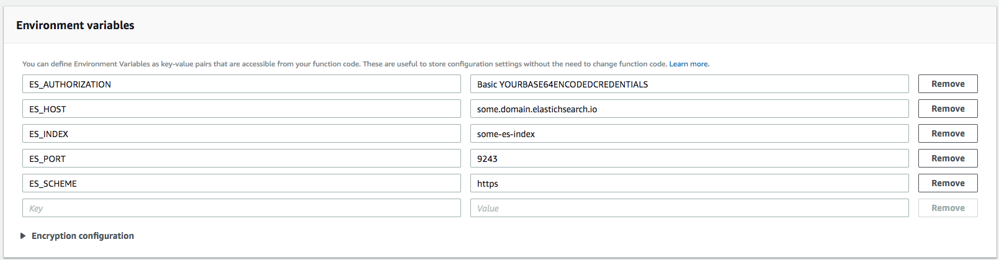

# dynamodb-elasticsearch-replicator
This is a generic Java 8 lambda that runs on AWS serverless architecture. The primary
function of this lambda is to replicate rows from DynamoDB to Elasticsearch clusters

You do not need to use AWS's own managed Elasticsearch Service

# Usage
## Package
```bash
mvn test package
ls target/
# you should see dynamodb-elasticsearch-replicator-1.0-SNAPSHOT.jar
```

## Upload
In the lambda page upload the compiled jar (or you can use awscli), or you can pre-upload
the jar to S3

## Configurations
Use environment variables to configure your Elasticsearch End Point

Example:


## Authorization
Any credentials (for example Base64 encoded `username:password` pairs under the `Basic` scheme) can he
passed in via the `ES_AUTHORIZATION` environment variable
